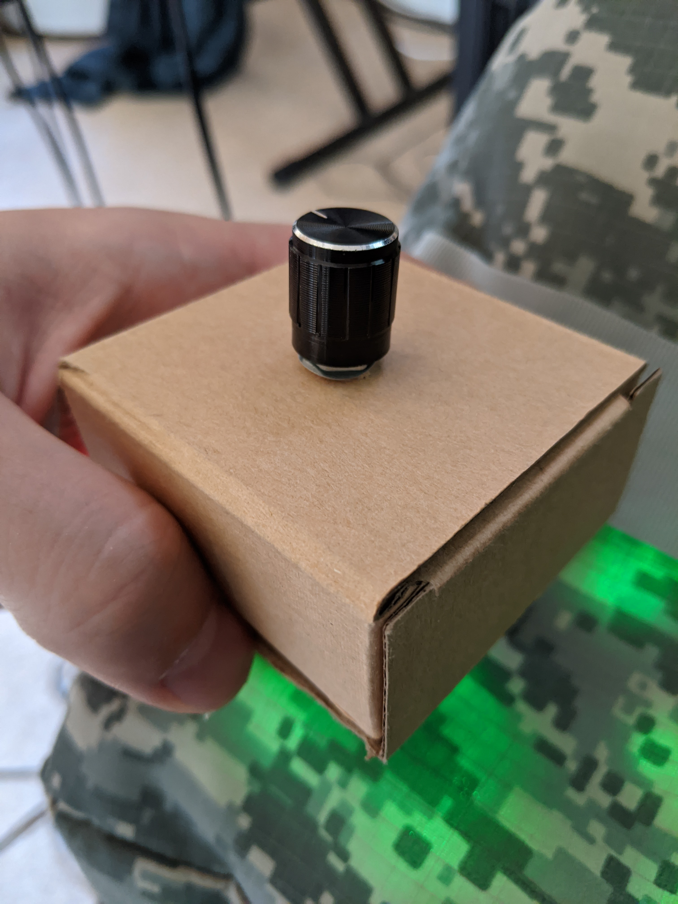
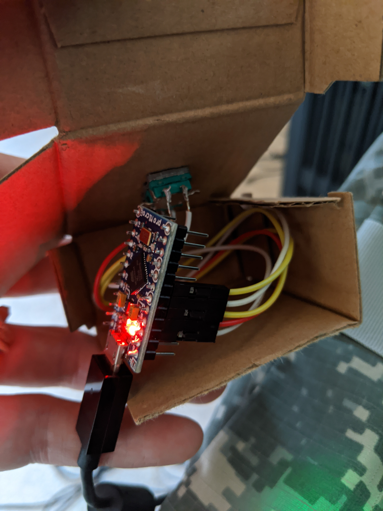

# Example: Nick's Knob Box
This is the first button box I created for MSFS2020. It's incredible basic, but does the job.

 

# Setup Instructions
1. Download and install all the software listed in the main [README](/README.md "The main readme").
2. Plug in the box.
   * If you find the device isn't recognised, you may need a different cable. I found it to be quite picky. In the end I used a charge and play cable for my Xbox 360 controller.
3. Open MobiFlight and FSUIPC7.
4. In MobiFlight use `File > Open` and load the [Nick's Knob configuration file](example-nicks-knob-mobiflight-config.cc "Example mobiflight configuration for Nick's Knob box").
5. Click `Run` in Mobiflight.
6. Load MSFS2020 & jump into a cockpit with a G1000.
7. Turn the dial and watch the AP altitude change.
8. Click the dial and watch the FLC speed be set to 100kts.
9. Enjoy.
